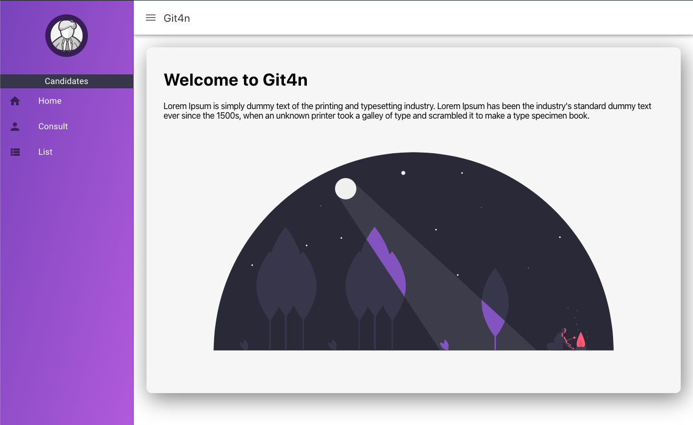
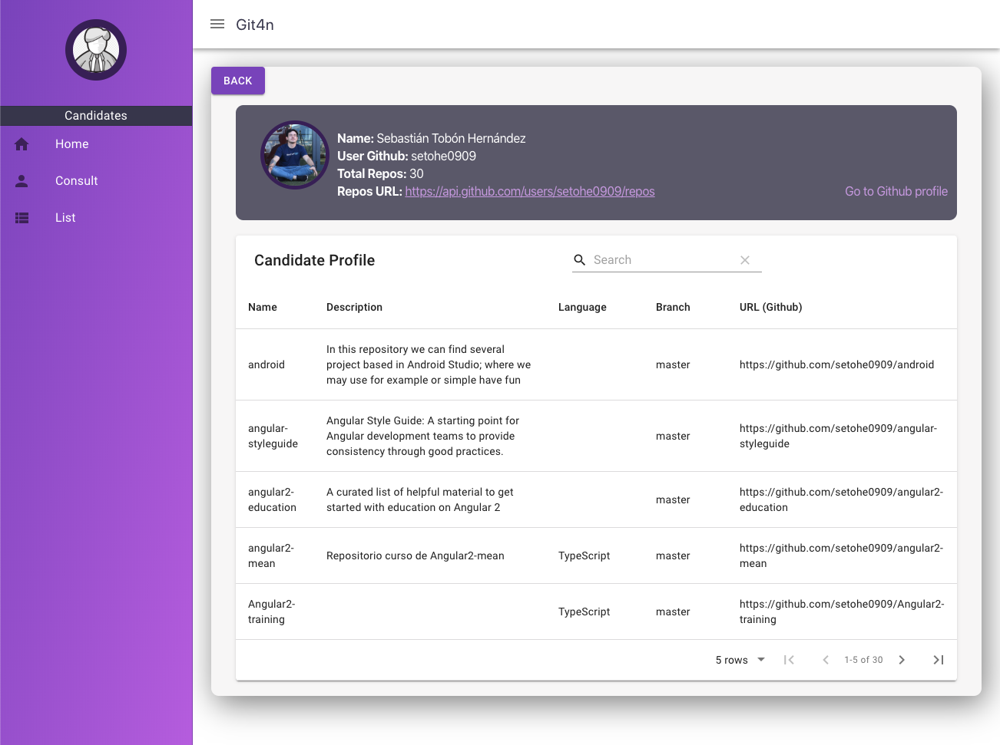
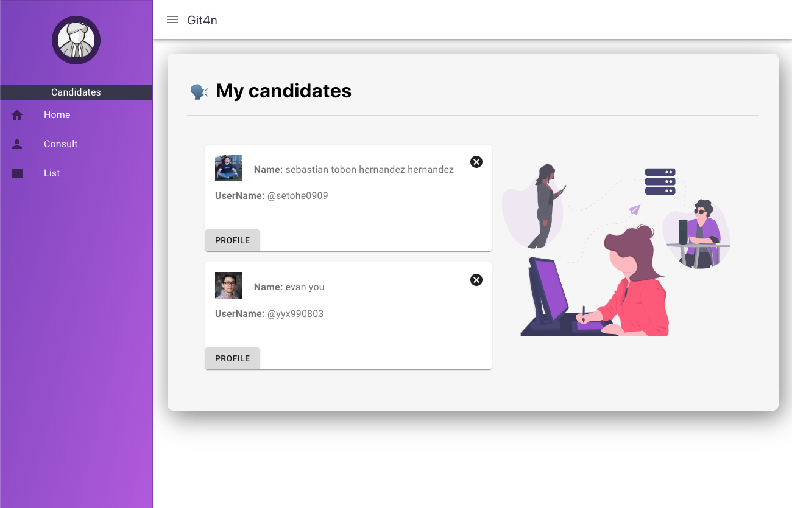
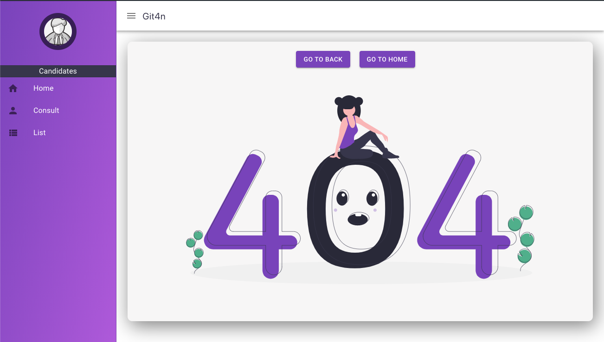

## Start
Debug: 
 ```
  $ npm install
  $ npm start
 ```

 And 

 ### Go to: http://localhost:3000

 ## Features

 - React
 - material-ui
 - js-cookie
 - classname
 - react-router
 - axios
 - react-material-ui-form-validator
 - material-table

 ## Screens

#### 1- Home

 

#### 2- Consult Candidate

 

#### 3- Candidate

 

#### 3- List of Candidates

 

#### 4- Not Found

 

## License

[](https://creativecommons.org/publicdomain/zero/1.0/)

To the extent possible under law, [Seto](https://github.com/setohe0909) has waived all copyright and related or neighboring rights to this work.
